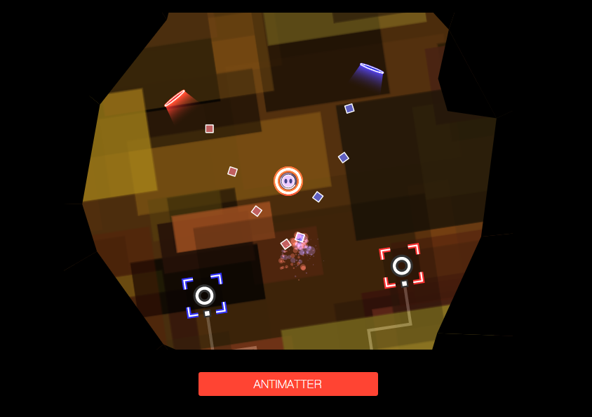

Hyperspace Garbage Collection
===

Backstory
---
At the multiverse juncture known as Alpha Omnicron Seven, `N4n`, a waste management systems machine, has been diligently maintaining the Variadic Intergalactic Garbage Processing Plant for the past seven millenia. A nineteenth generation Cyber-Fruit Inc. design, `N4n` features a dual-mode force-field, a levitation-engine, and a proprietary emotion display.

The Plant accepts both matter and anti-matter for processing and recycling. Day-to-day operations are automated and municipalities must adhere to a strict delivery schedule to avoid complete annihilation.

Unfortunately, the Reptilian Corgiods of Universe 8N9 (∆*f* = 2.47 µHz) have teleported several millitons of antimatter space-poop through their garbage warp hole -0.2 seconds ahead of schedule.

The suboptimal imbalance of matter and anti-matter has resulted
in multiple catastrophic detonation events. Massive structural failures in the loading dock have been reported. The cascade of radiation has overloaded `N4n`'s artificial intelligence cores.

Manual overrides have now been activated. Guide `N4n` through the dangerous trash-heap caverns to reach the Primary Systems Core and restore compliance to the Trash.

Dependencies
---
* [Box2dWeb](code.google.com/p/box2dweb/)
* [RequireJS](github.com/jrburke/requirejs)

Developer dependencies
---
* [Sass](github.com/nex3/sass)
* [Compass](github.com/chriseppstein/compass)
* [Jade](github.com/visionmedia/jade)
